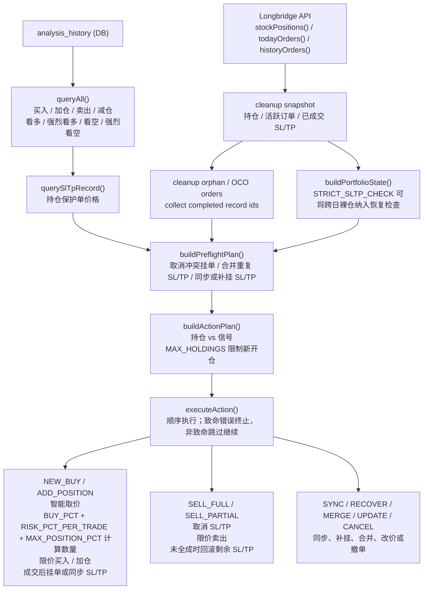

# trading-scripts

基于 [Longbridge OpenAPI](https://open.longbridge.com) 的自动交易脚本，读取 [daily_stock_analysis](https://github.com/ZhuLinsen/daily_stock_analysis) 生成的分析报告并自动执行买卖下单。


## 功能

- 从 SQLite 数据库读取分析报告（含情绪评分、操作建议、买卖价格）
- **实时持仓对比**：从 Longbridge API 获取持仓和活跃订单，与信号做对比，无需本地状态文件
- 自动过滤 A 股，仅处理港股和美股标的
- **智能取价**：优先使用盘口深度（卖一/买一），其次盘前/盘后/夜盘价格，最后 `lastDone`
- 买入信号：以阈值最高价（目标价 × (1 + 阈值%)）提交限价单 (LO)，10 秒超时未成交则跳过
- 买入数量：先按 `BUY_PCT` 限制可用购买力，再按 `RISK_PCT_PER_TRADE` 和止损价限制单笔最大风险
- 组合约束：支持 `MAX_POSITION_PCT` 单标的上限和 `MAX_HOLDINGS` 最大持仓标的数
- 卖出信号：以买一价提交限价单 (LO)，支持全仓卖出和按比例减仓；卖出前取消 SL/TP，失败时自动回滚
- **启动前 SL/TP 预检查**：开盘前先检查持仓的止损止盈单，自动合并重复挂单并按最新信号价格同步
- SL/TP 自动同步：持仓数量或信号价格变化时自动调整挂单
- SL/TP 自动补挂：持仓但无止损止盈时，从 24h 内信号（或最近记录）中恢复
- 严格保护单检查：开启 `STRICT_SLTP_CHECK=true` 后，跨日持仓缺少可见 SL/TP 也会进入补挂检查
- 孤儿订单清理：基于 `todayOrders()` API 自动撤销无父订单的 SL/TP + OCO 互斥清理
- 支持人工确认和全自动 (`--auto-approve`) 两种模式

## 交易流程



**Action 类型**

| Action | 条件 | 行为 |
| --- | --- | --- |
| `NEW_BUY` | 不持仓 + 买入信号（买入，或持有/观望/空建议 + 看多/强烈看多）+ 无 pending 买单 | 限价买入，成交后自动挂 SL/TP |
| `ADD_POSITION` | 已持仓 + 信号=加仓 + 无 pending 买单 | 限价加仓，成交后将 SL/TP 同步到新总持仓 |
| `UPDATE_BUY` | 有 pending 买单 + 信号价格不一致 | `replaceOrder` 同步 |
| `SELL_FULL` | 持仓 + 卖出信号（卖出，或持有/观望/空建议 + 看空/强烈看空） | 取消 SL/TP → 限价卖出（挂买一） |
| `SELL_PARTIAL` | 持仓 + 信号=减仓 | 取消 SL/TP → 限价卖 sellPct%（挂买一） |
| `SYNC_SL_TP` | 持仓 + SL/TP 数量或价格 ≠ 信号 | `replaceOrder` 调整数量和/或价格 |
| `RECOVER_SL_TP` | 持仓 + 无 SL/TP + 信号有止损止盈 | 补挂 MIT + LIT |
| `MERGE_SL_TP` | 持仓 + 同侧有多张止损/止盈挂单 | 先撤重复单，再按最新信号重挂一对 |
| `HOLD` | 持仓 + SL/TP 已匹配 | 不操作 |

## 快速开始

### 1. 注册 OAuth Client

```bash
curl -X POST https://openapi.longbridge.com/oauth2/register \
  -H "Content-Type: application/json" \
  -d '{
    "client_name": "Trading Scripts",
    "redirect_uris": ["http://localhost:60355/callback"],
    "grant_types": ["authorization_code", "refresh_token"]
  }'
```

保存返回的 `client_id`。

### 2. 配置环境变量

复制 `.env.example` 为 `.env` 并根据其内置说明填写你的配置。

### 3. 交易

``` bash
pnpm trade # 人工确认模式
pnpm trade --auto-approve # 全自动模式
pnpm trade --dry-run # 试运行（连接交易所，展示“启动前预检查 + 交易行动计划”，不实际下单）
```

首次运行 `pnpm trade` 时，会打开浏览器完成 Longbridge OAuth 授权（**提示**：可以使用模拟账户完成授权和测试，无需真实资金）。Token 缓存在 `~/.longbridge/openapi/tokens/<client_id>`。

## Docker

```bash
# 拉取最新镜像
docker pull ghcr.io/bowencool/trading-scripts:latest

# 自动交易（人工确认模式）
docker run --rm \
  -e CLIENT_ID=your-client-id \
  -v /path/to/stock_analysis.db:/app/db/stock_analysis.db:ro \
  -v ~/.longbridge:/root/.longbridge \
  ghcr.io/bowencool/trading-scripts trade

# 自动交易（全自动模式）
docker run --rm \
  -e CLIENT_ID=your-client-id \
  -v /path/to/stock_analysis.db:/app/db/stock_analysis.db:ro \
  -v ~/.longbridge:/root/.longbridge \
  ghcr.io/bowencool/trading-scripts trade --auto-approve

# 试运行（连接交易所，展示“启动前预检查 + 交易行动计划”，不实际下单）
docker run --rm \
  -e CLIENT_ID=your-client-id \
  -v /path/to/stock_analysis.db:/app/db/stock_analysis.db:ro \
  -v ~/.longbridge:/root/.longbridge \
  ghcr.io/bowencool/trading-scripts trade --dry-run

```

**挂载说明**

| 容器路径            | 说明                                                                                                             |
| ------------------- | ---------------------------------------------------------------------------------------------------------------- |
| `/app/db/stock_analysis.db` | 容器内固定数据库路径；将宿主机上的 `stock_analysis.db` 只读挂载到这里 |
| `/root/.longbridge` | OAuth token 缓存（首次授权后可复用）                                                                             |

> **提示**：Docker 镜像内已固定 `DB_PATH=/app/db/stock_analysis.db`，不需要额外传 `DB_PATH` 环境变量；如需更换数据库文件，请调整宿主机挂载源路径，容器目标路径保持不变。

> **注意**：镜像体积较大（~700MB），主要由 [Longbridge SDK](https://github.com/longportapp/openapi-sdk) 的平台原生绑定（arm64/x64）、Node.js 运行时及 tsx（TypeScript 执行环境）共同构成。

## ⚠️ 免责声明

**本项目仅供学习和研究用途，不构成任何投资建议。**

使用本脚本所产生的一切投资行为及其结果，由使用者本人自行承担全部责任。作者不对因使用本项目而导致的任何直接或间接的经济损失、资金损失或其他任何形式的损害承担责任。

本脚本可能存在未知的 Bug、逻辑缺陷或不可预见的情况，均可能导致意外的交易行为。**在使用前，请充分了解风险，并在模拟账户中进行充分测试。** 请勿将本项目用于超出自身风险承受能力的交易场景。

投资有风险，入市需谨慎。
