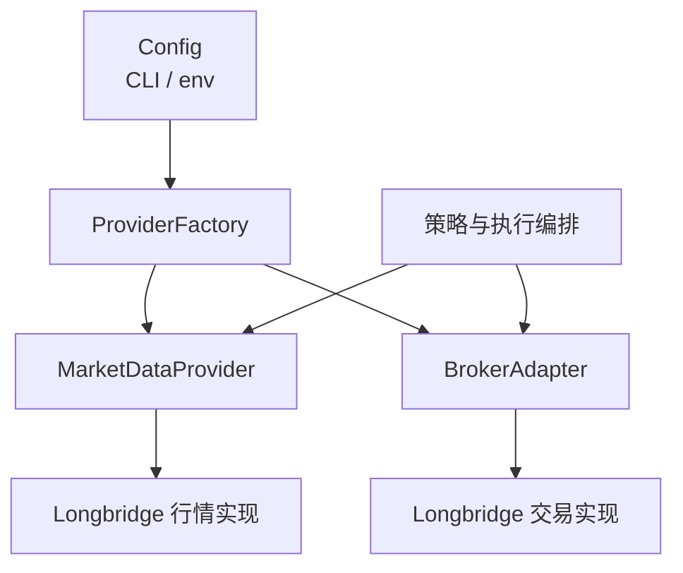

# 行情 Provider 与 Broker Adapter 当前架构

## 架构

行情与交易是两个独立选择的边界。业务层只使用 provider-neutral 的接口和领域类型；供应商 SDK、认证、类型映射及特有限制位于对应实现层。当前行情和交易均支持 `longbridge`。

## 接口与领域类型

- `Instrument` 使用无供应商后缀的规范化 symbol 和显式 market，例如 `{ symbol: "AAPL", market: "US" }`；供应商实现负责外部 symbol 转换。
- `MarketDataProvider` 提供批量报价、盘口和证券静态信息。业务层按盘口、盘前/盘后/夜盘报价、最新价的顺序取价。
- `BrokerAdapter` 提供账户、持仓、订单查询、基础订单生命周期及 bracket/保护单高阶操作。
- 金额、价格和数量使用 `number`；订单状态统一为 pending、partially-filled、filled、canceled、rejected、expired、unknown。
- 无法映射的供应商状态标记为 unknown；供应商原始异常可以作为 cause 保留。

## 配置与生命周期

- 行情选择逐项按 `--market-data`、`MARKET_DATA_PROVIDER`、缺失错误的顺序解析。
- 交易选择逐项按 `--broker`、`BROKER_PROVIDER`、缺失错误的顺序解析。
- CLI 和环境变量使用相同 allowlist；CLI 已提供某项时，对应环境变量不参与该项校验。
- `--help` 不依赖 Provider 环境变量。Provider 选择校验早于认证、API 连接和启动清理。
- Longbridge OAuth 客户端 ID 使用 `LONGBRIDGE_CLIENT_ID`。
- 行情与交易共享一次供应商认证配置，各自持有独立的行情和交易 Context。
- 所有 Provider API 调用顺序执行，不做并发优化；供应商限流细节位于对应实现层。
- `dry-run` 可以读取账户、订单和行情，不提交、修改或撤销订单。

## 订单保护语义

- `waitForTerminal` 只等待当前短任务中的单张订单，不代表常驻监听。
- Longbridge 的 `protectionMode` 为 `reconciled-orders`：止损和止盈是两张独立 GTC 订单，一张成交后，另一张在下次脚本启动时清理；该模式不是实时或服务端原生 OCO。
- bracket、保护单创建/同步/撤销及启动清理封装在 `BrokerAdapter` 内，业务层不拼装供应商特有操作步骤。
- Broker 的订单事件订阅仅在实际执行段启动，并通过 `try/finally` 保证停止。

## 数据与测试约束

- `analysis_history` 保持只读；Longbridge remark 格式和幂等识别保持稳定。
- 契约测试验证 MarketDataProvider 与 BrokerAdapter 可以独立实现，返回值不含供应商 SDK 类型。
- 映射测试覆盖 symbol、行情时段、盘口、lot size、余额、持仓、订单状态、价格、数量和 remark。
- 回归测试覆盖基础下单、改单、超时撤单、保护单创建/同步/回滚、启动清理和短任务退出。
- 保护单测试按 `reconciled-orders` 的下次启动清理语义断言，不按实时 OCO 断言。
