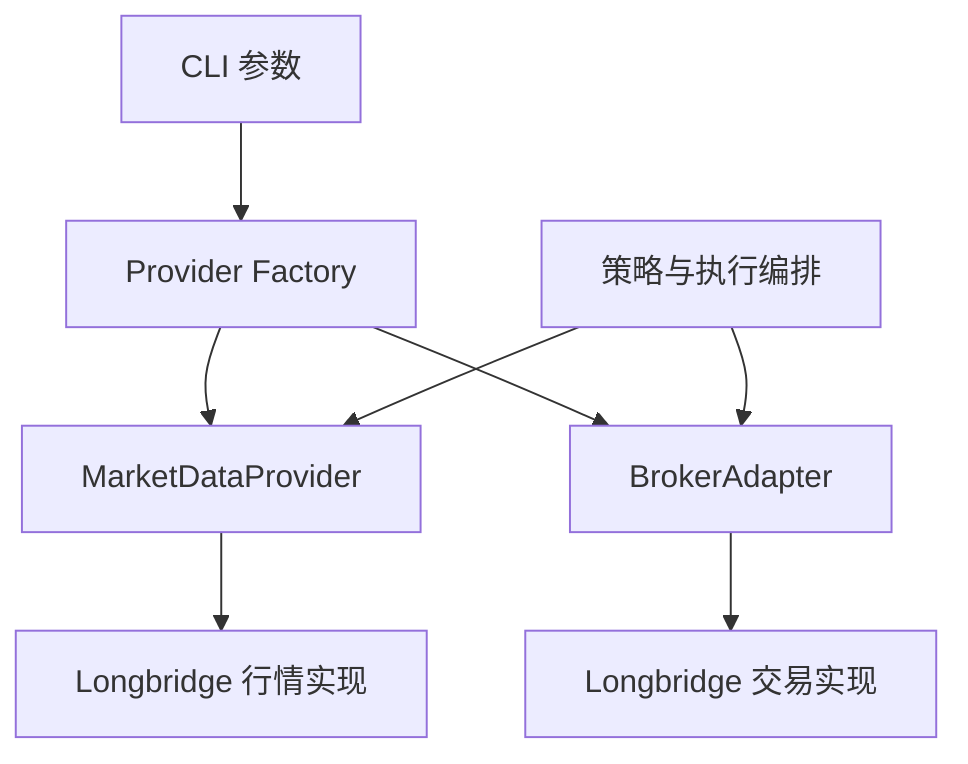

# 行情 Provider 与 Broker Adapter 设计

## 目标

把行情和交易拆成两个可独立选择的边界。业务层只使用券商无关的领域类型；Longbridge SDK 的 Context、枚举和 Decimal 仅允许出现在 Longbridge 实现内。本次实现 Longbridge，接口为后续“Longbridge 行情 + Schwab 交易”预留组合能力。

## 架构

- `Instrument` 使用无供应商后缀的规范化 symbol 与显式 market，例如 `{ symbol: "AAPL", market: "US" }`。Longbridge 实现负责转换为 `AAPL.US`。
- `MarketDataProvider` 提供批量报价、盘口和证券静态信息。报价携带盘前、盘后、夜盘价格，业务层继续按盘口优先、分时段报价回退、最后成交价兜底。
- `BrokerAdapter` 提供账户、持仓、订单查询和基础订单生命周期，并提供 bracket 与保护单高阶操作。业务金额、价格和数量统一使用 `number`。

## 订单与保护语义

- 统一订单状态为 pending、partially-filled、filled、canceled、rejected、expired、unknown；供应商的细粒度状态在实现边界映射。
- `waitForTerminal` 只覆盖当前短任务中对一张订单的等待。超时撤单属于 Adapter 实现，不代表常驻监听。
- Longbridge 的 `protectionMode` 是 `reconciled-orders`：止损和止盈为两张独立 GTC 订单，其中一张成交后，另一张到下次启动清理时才撤销。
- 未来 Schwab Adapter 可把同一高阶请求映射为 `native-bracket`，由服务端执行 TRIGGER + OCO。
- bracket、创建/同步/撤销保护单以及启动清理都封装在 Adapter 中；业务层不得根据券商能力自行拼装 Longbridge 操作步骤。

## 运行与错误边界

- Provider 选择逐项遵循 `CLI > env > error`：`--market-data` 覆盖 `MARKET_DATA_PROVIDER`，`--broker` 覆盖 `BROKER_PROVIDER`；完整规则见 [Provider 环境变量回退设计](./2026-07-11-provider-env-fallback-design.md)。选择校验必须早于认证、API 连接和启动清理。
- Longbridge OAuth 客户端 ID 只从 `LONGBRIDGE_CLIENT_ID` 读取；该硬改名不保留旧通用名称回退。
- 所有 Provider API 调用保持顺序执行，不做并发优化；供应商的具体限流细节留在对应实现层。行情与交易可共享认证配置，但不得共享 Context 或在业务层互相依赖。
- 供应商错误可保留原始异常作为 cause；业务层只依赖统一返回类型。无法映射的订单状态标为 unknown，不伪装为终态。
- dry-run 可以读取账户、订单和行情，但不得提交、修改、撤销订单；清理只返回计划结果。

## 测试与验收

- 纯契约测试用假实现验证两个接口可独立实现，且返回值不依赖 Longbridge 类型。
- Longbridge 映射测试覆盖 symbol、行情时段、盘口、lot size、余额、持仓、订单状态、价格、数量和 remark。
- 回归测试覆盖基础下单、改单、超时撤单、保护单创建/同步/回滚、启动清理和短任务退出。
- 明确测试止盈或止损成交后仅在下次启动清理另一单，防止把 reconciled-orders 误认为实时 OCO。

## 明确边界

- 本次不实现 Schwab、不新增常驻守护进程、不改变策略和仓位算法、不修改数据库结构。
- `analysis_history` 继续只读；Longbridge remark 格式和幂等识别保持不变。
- 行情与交易选择保持独立；CLI 和环境变量使用相同 allowlist，二者都缺失时才报错。
